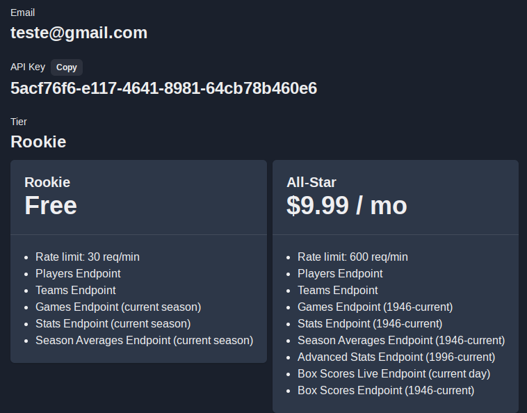

# helper-api-dotnet-o5

HELPER OPENED API

# Grupo1 (Busca Feriados Nacionais):

- Rodrigo dos Santos

# Grupo2 (Busca Municípios):

- Quellen Rodrigues

# Grupo3 (Busca Fipe por ano e parte do nome do modelo):

- Adjailson Domingos
- Nariana Regina
- Thalles Ariel Oliveira

# Grupo4 (Busca taxa CDI e calcular os rendimentos de um valor investido e corrigido em um período):

- André da Silva
- Hugo Somers
- Renan Olivé

# Grupo5 (Busca Moedas):

- Luís Eduardo Giacomini
- Matheus Karo
- Mauro Augusto

# Grupo6 (API Vagalume - Busca por Música):

- Jonathan Louback
- João Paulo
- Arthus Bernardo Coelho

# Grupo7 (Busca CNPJ):

- Gabriel Meneses
- Lucas Cruz
- Fabrício Gomes

# Grupo8:

- Tiago Rodrigues
- Isabele Moreira
- Rodrigo Batista

# Grupo9 (https://github.com/PokeAPI/pokedex-promise-v2):

- Lucas Willian Rocha
- Isabelle Caroline
- Carlos Henrique de Moura

# Grupo10 (https://docs.awesomeapi.com.br/api-de-moedas):

- Gabriela Santana
- Talita Ferreira de Lima
- Wellington Cordeiro

# Grupo 11 (Busca Informações de Bancos por parte do Nome):

- Alex Artilha
- Ítalo Emídio

# Grupo 12

## Integrantes

- Wagner Cipriano
-

## API

A API utilizada fornece informações da liga de basquete americano (NBA):

- `https://www.balldontlie.io/`
- `https://api.balldontlie.io/v1/teams`

Esta API _necessita KEY_, mas não precisamos nem usar dados reais para criar, foi criada com email de teste sem problemas, conforme dados abaixo:

```
Email: teste@gmail.com
API Key: 5acf76f6-e117-4641-8981-64cb78b460e6
```

### Endpoints utilizados

- https://api.balldontlie.io/v1/teams
- https://api.balldontlie.io/v1/games?period=4&seasons[]=2023

### Restrições

- A versão gratuita disponibiliza apenas dados da temporada atual (`seasons[]=2023`)
- Esta API possui uma restrição de 30 requisições por minuto, conforme print abaixo:



## Importante

Em um projeto real, esta Key da API **NUNCA** deveria ficar chapada no código, deveria claro ficar em uma _variável de ambiente_, arquivo .env.
Porém para evitar causar "dificuldades" para os colegas que forem testar, ficou _hard coded_ mesmo.

## REFS:

- Site 1
- Site 2
